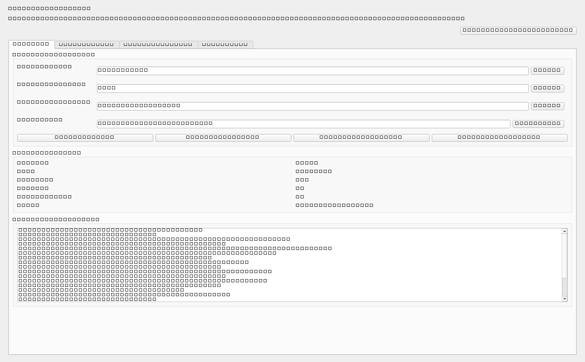
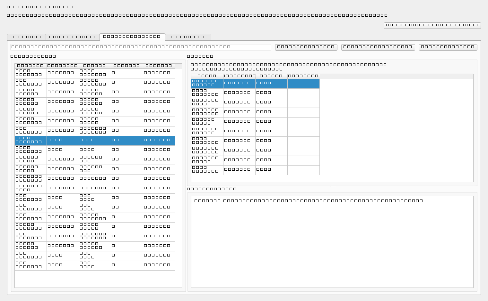

# Open Scrapers Desk Wiki

Open Scrapers Desk is the desktop companion for the separate Open Scrapers Toolkit repository. It is a PyQt application for people who want to run scrapers, browse saved JSON output, and read structured datasets without living in a terminal window.

This wiki is the long-form operational guide for the desktop app. It explains how the app connects to the toolkit, how its tabs work, where it stores settings, how Windows packaging is handled, and how to publish releases without breaking the backend relationship.



## Who this repository is for

- users who want a GUI for the scraper toolkit
- maintainers packaging Windows builds
- contributors extending the app
- people who need a readable interface for the JSON output produced by the toolkit

## Start here

- [Installation](Installation.md)
- [Connecting to the Toolkit](Connecting-to-the-Toolkit.md)
- [Using the Desktop App](Using-the-Desktop-App.md)
- [Settings and Data Locations](Settings-and-Data-Locations.md)
- [Architecture](Architecture.md)
- [Packaging Windows Builds](Packaging-Windows-Builds.md)
- [Publishing Releases](Publishing-Releases.md)
- [Troubleshooting](Troubleshooting.md)
- [FAQ](FAQ.md)

## The two-repo model

The Open Scrapers ecosystem is intentionally split into two repositories:

- `open-scrapers-toolkit`: the TypeScript scraper backend, CLI, and source catalog
- `open-scrapers-desk`: the PyQt desktop application and Windows packaging layer

That split keeps the backend reusable for developers while giving non-programmers a dedicated product surface.

## What the desktop app does

The app can:

- validate a toolkit checkout and Node runtime
- load the scraper catalog through the toolkit CLI
- run one scraper, one category, or the full catalog
- capture live command output in the UI
- scan JSON output folders automatically
- render result files in a searchable reader
- open source links and output folders
- expose a built-in Ko-fi support button



## Typical first-run workflow

1. Prepare the toolkit repository with `npm install` and `npm run build`.
2. Install the desktop app dependencies or launch the packaged `.exe`.
3. Open the app and set the toolkit path, Node path, and output directory on the Overview tab.
4. Click **Validate Backend**.
5. Refresh the scraper catalog.
6. Run a scraper from the Run Scrapers tab.
7. Read the saved JSON in the Results Library tab.

## Default support link

The application ships with Ninezel's Ko-fi page as the default support link:

- `https://ko-fi.com/ninezel`

Users can still override the link in settings if they are maintaining a branded fork.

## Quick navigation

If you are new here:

- start with [Installation](Installation.md)
- then read [Connecting to the Toolkit](Connecting-to-the-Toolkit.md)
- then move to [Using the Desktop App](Using-the-Desktop-App.md)

If you are packaging or publishing:

- read [Packaging Windows Builds](Packaging-Windows-Builds.md)
- then [Publishing Releases](Publishing-Releases.md)

## Refreshing the screenshots

The desktop wiki screenshots are generated from the live application through an offscreen capture script:

```powershell
python scripts\capture_wiki_screenshots.py
```
