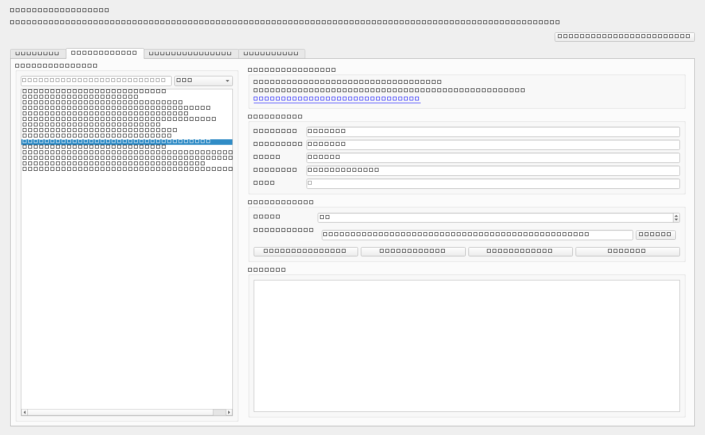
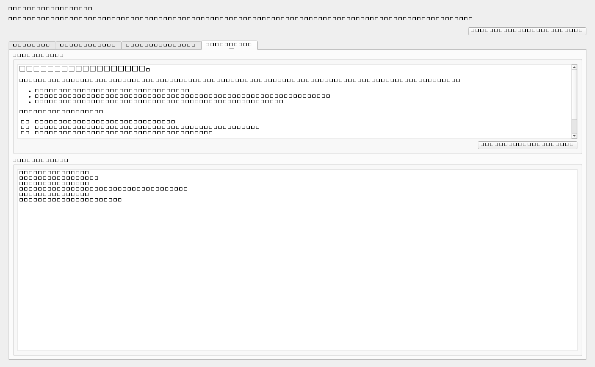

# Using the Desktop App

This page walks through the four main tabs in Open Scrapers Desk and the normal workflows people use inside the application.

## Overview tab

The Overview tab is the control room for the app. It lets you configure the backend connection, save settings, and verify that the toolkit is usable.

### Fields and actions

- `Toolkit path`: points to the separate toolkit repository
- `Node executable`: usually `node`, or a full path to `node.exe`
- `Output directory`: where result JSON files are stored and scanned
- `Ko-fi link`: opens the built-in support button destination
- `Save Settings`
- `Validate Backend`
- `Refresh Everything`
- `Open Output Folder`

### Status snapshot

The status panel reports:

- toolkit status
- Node version
- CLI mode
- scraper catalog count
- result file count
- notes from validation

### Latest result files

The bottom section lists recent JSON results. Double-clicking one jumps you into the Results Library tab with that file selected.

## Run Scrapers tab

This tab is where users browse the scraper catalog and execute jobs.

### Scraper catalog panel

The left side includes:

- a text filter
- a category picker
- the loaded scraper list

You can filter by name, category, or description text.

### Selected scraper panel

When a scraper is selected, the app shows:

- scraper name
- category
- description
- homepage link
- supported parameters

If the scraper has no parameters, the UI says so explicitly.

### Run controls

The run controls support:

- record limit
- output file selection
- catalog refresh
- `Run Selected`
- `Run Category`
- `Run All`

### Live process output

The run log captures standard output and standard error from the toolkit command. This makes debugging much easier than silent failure.

## Results Library tab

This tab turns saved JSON files into a readable workspace.

### File list

The left side shows discovered JSON result files with columns for:

- scraper
- category
- source
- record count
- fetched timestamp

### Record browser

When a file is selected, the app loads the normalized payload and shows:

- a record table
- a summary line with scraper name, category, count, and timestamp
- a detail pane for the selected record

### Search and filtering

The record filter searches across:

- title
- summary
- author names
- tags
- source
- location

### External file loading

You can also open a JSON file directly even if it was not already in the scanned library.

## Logs & Help tab

This tab includes:

- a quick-start help panel
- an activity log
- another Ko-fi support button

The activity log records important events such as:

- settings saves
- backend validation results
- catalog refreshes
- run starts
- run finishes
- file-load actions

## Common user workflows

### Run one scraper and read it immediately

1. Go to the Run Scrapers tab.
2. Choose a scraper.
3. Adjust the limit and optional parameters.
4. Pick an output file.
5. Click **Run Selected**.
6. Let the app refresh the Results Library automatically.

### Run a whole category

1. Choose a category in the filter box.
2. Click **Run Category**.
3. Wait for the batch to complete.
4. Review the saved JSON files in the Results Library.

### Inspect older outputs

1. Open the Results Library tab.
2. Refresh the library if needed.
3. Select any result file.
4. Filter records by keywords.
5. Open source links from the detail pane when present.

## Ko-fi support flow

The app ships with Ninezel's Ko-fi page as the default support link:

- `https://ko-fi.com/ninezel`

The link can be overridden in settings for forks or branded distributions. If a valid Ko-fi URL is present, the support buttons become active and open the page in the user's browser.
